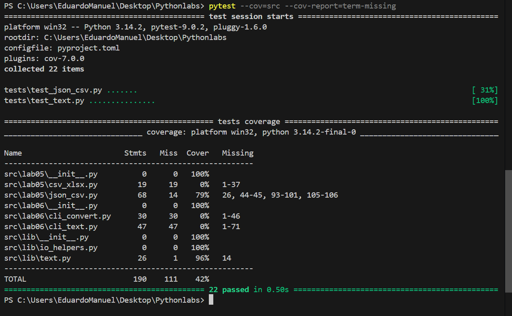

# TAREFA A

```python
import pytest
# Importa as funções do seu arquivo text_tools.py
import sys
import os

sys.path.append(os.path.join(os.path.dirname(__file__), ".."))

from src.lib.text import normalize, tokenize, count_freq, top_n

# --- Testes para a função normalize ---
@pytest.mark.parametrize(
    "text_in, expected_out, casefold_val, yo2e_val",
    [
        # Caso básico: espaços, quebras de linha e casefold padrão
        ("Olá Mundo\nEste é um teste.  ", "olá mundo este é um teste.", True, True),
        # Caso sem casefold
        ("Olá Mundo", "Olá Mundo", False, True),
        # Caso russo com substituição de 'ё' (padrão)
        ("Пётр Чайковский", "петр чайковский", True, True),
        # Caso russo sem substituição de 'ё'
        ("Пётр Чайковский", "пётр чайковский", True, False),
        # Caso misto complexo
        ("  TESTE\tCom\nEspaços\rEspeciais ", "teste com espaços especiais", True, True),
    ],
)
def test_normalize(text_in, expected_out, casefold_val, yo2e_val):
    """Testa a função normalize com vários parâmetros de entrada."""
    result = normalize(text_in, casefold=casefold_val, yo2e=yo2e_val)
    assert result == expected_out


# --- Testes para a função tokenize ---
@pytest.mark.parametrize(
    "text_in, expected_out",
    [
        # Caso básico: palavras, números e hífens
        ("Aqui estão 2 exemplos: teste-hifenizado e mais um.",
         ['aqui', 'estão', '2', 'exemplos', 'teste-hifenizado', 'e', 'mais', 'um']),
        # Ignorando pontuação
        ("O quê? Isso é um teste, certo!",
         ['o', 'quê', 'isso', 'é', 'um', 'teste', 'certo']),
        # Texto com apenas números e símbolos
        ("123, 456. abc!",
         ['123', '456', 'abc']),
    ],
)
def test_tokenize(text_in, expected_out):
    """Testa a função tokenize para extração correta de tokens."""
    assert tokenize(text_in) == expected_out


# --- Testes para a função count_freq ---
@pytest.mark.parametrize(
    "tokens_in, expected_out",
    [
        # Caso simples com repetições
        (['gato', 'cão', 'gato', 'peixe', 'cão', 'gato'],
         {'gato': 3, 'cão': 2, 'peixe': 1}),
        # Caso sem repetições
        (['a', 'b', 'c'],
         {'a': 1, 'b': 1, 'c': 1}),
        # Caso com lista vazia
        ([], {}),
    ],
)
def test_count_freq(tokens_in, expected_out):
    """Testa a contagem de frequência de diferentes listas de tokens."""
    assert count_freq(tokens_in) == expected_out


# --- Testes para a função top_n ---
@pytest.mark.parametrize(
    "freq_in, n_val, expected_out",
    [
        # Teste padrão (n=5 por default, mas explicitado aqui)
        ({'a': 10, 'b': 20, 'c': 5, 'd': 50, 'e': 1, 'f': 15}, 5,
         [('d', 50), ('b', 20), ('f', 15), ('a', 10), ('c', 5)]),
        # Teste com limite n=2
        ({'banana': 5, 'maçã': 3, 'laranja': 8, 'uva': 1}, 2,
         [('laranja', 8), ('banana', 5)]),
        # Teste de desempate (tie-breaking) por ordem alfabética
        ({'zebra': 5, 'abacate': 5, 'bola': 5}, 3,
         [('abacate', 5), ('bola', 5), ('zebra', 5)]),
        # Teste onde n é maior que o número de itens
        ({'um': 1, 'dois': 2}, 10,
         [('dois', 2), ('um', 1)]),
    ],
)
def test_top_n(freq_in, n_val, expected_out):
    """Testa a ordenação e o limite da função top_n."""
    # Nota: A função top_n no seu código original espera o 'n' como argumento posicional agora,
    # então a chamada aqui é top_n(freq_in, n_val).
    assert top_n(freq_in, n=n_val) == expected_out
```

# TAREFA B

```python

import pytest
from pathlib import Path
import json
import csv
import sys
import os

sys.path.append(os.path.join(os.path.dirname(__file__), ".."))
from src.lab05.json_csv import json_to_csv, csv_to_json


# ---------------------------------------------------------------#
# -------------------TESTES JSON2CSV----------------------------#
# ---------------------------------------------------------------#
def test_json_to_csv_path_validation(tmp_path: Path):
    """Validate the JSON path. File MUST be a .json file"""
    src = tmp_path / "people"
    dst = tmp_path / "people.csv"
    # with pytest.raises(ValueError):
    #   json_to_csv(str(src), str(dst))
    assert json_to_csv(str(src), str(dst)) is False

# ---------------------------------------------------------------#
def test_json_to_csv_empty_file(tmp_path: Path):
    """Validate the JSON file content - file CAN NOT BE empty"""
    src = tmp_path / "emptyfile.json"
    dst = tmp_path / "people.csv"
    data = []
    src.write_text(json.dumps(data, ensure_ascii=False, indent=2), encoding="utf-8")
    # with pytest.raises(ValueError):
    #    json_to_csv(str(src), str(dst))
    assert json_to_csv(str(src), str(dst)) is False


# ---------------------------------------------------------------#
def test_json_to_csv_roundtrip(tmp_path: Path):
    """Test converting CSV data to JSON format."""
    src = tmp_path / "people.json"
    dst = tmp_path / "people.csv"
    data = [
        {"name": "Alice", "age": "22"},
        {"name": "Bob", "age": "25"},
    ]
    # Write "data" in file people.json
    src.write_text(json.dumps(data, ensure_ascii=False, indent=2), encoding="utf-8")
    json_to_csv(str(src), str(dst))  # Now convert it to CSV

    with dst.open(encoding="utf-8") as f:
        rows = list(csv.DictReader(f))  # get wht is written on new json file

    assert len(rows) == 2
    assert {"name", "age"} <= set(rows[0].keys())  # Verify if there are the headers


# ---------------------------------------------------------------#
# -------------------TESTES CSV2JSON----------------------------#
# ---------------------------------------------------------------#
def test_csv_to_json_path_validation(tmp_path: Path):
    """Validate the CSV path. File MUST be a .csv file"""
    src = tmp_path / "people"
    dst = tmp_path / "people.json"
    data = [
        {"name": "Alice", "age": 22},
    ]
    with src.open("w", newline="", encoding="utf-8") as f:
        writer = csv.DictWriter(f, fieldnames=["name", "age"])
        writer.writeheader()
        writer.writerows(data)
    # with pytest.raises(ValueError):
    #   csv_to_json(str(src), str(dst))
    assert csv_to_json(str(src), str(dst)) is False
# ---------------------------------------------------------------#
def test_csv_to_json_wrong_header(tmp_path: Path):
    """Validate the CSV file HEADER - HEADER MUST BE "name" and "age" """
    src = tmp_path / "WRONG_HEADER.csv"
    dst = tmp_path / "people.json"
    data = [
        {"NAME": "Alice", "AGE": 22},
    ]
    src.touch()  # Just open and close the file
    with src.open("w", newline="", encoding="utf-8") as f:
        writer = csv.DictWriter(f, fieldnames=["NAME", "AGE"])
        writer.writeheader()
        writer.writerows(data)
    # with pytest.raises(ValueError):
    #    csv_to_json(str(src), str(dst))
    assert csv_to_json(str(src), str(dst)) is True


# ---------------------------------------------------------------#
def test_csv_to_json_empty_file(tmp_path: Path):
    """Validate the CSV file content - file CAN NOT BE empty"""
    src = tmp_path / "emptyfile.csv"
    dst = tmp_path / "people.json"
    src.touch()  # Just open and close the file
    # with pytest.raises(ValueError):
    # csv_to_json(str(src), str(dst))
    assert csv_to_json(str(src), str(dst)) is False


# ---------------------------------------------------------------#
def test_csv_to_json_roundtrip(tmp_path: Path):
    """Test converting CSV data to JSON format."""
    src = tmp_path / "people.csv"
    dst = tmp_path / "people.json"
    data = [
        {"name": "Alice", "age": 22},
        {"name": "Bob", "age": 25},
    ]
    with src.open("w", newline="", encoding="utf-8") as f:
        writer = csv.DictWriter(f, fieldnames=["name", "age"])
        writer.writeheader()
        writer.writerows(data)
    assert csv_to_json(str(src), str(dst)) is True
    # Read the output JSON and assert its contents
    assert dst.exists()
    with dst.open(encoding="utf-8") as f:
        output_data = json.load(f)
    assert len(output_data) == 2
    # When converting back to JSON, it should match the original list of dictionaries
    assert {"name", "age"} <= set(output_data[0].keys())
```


