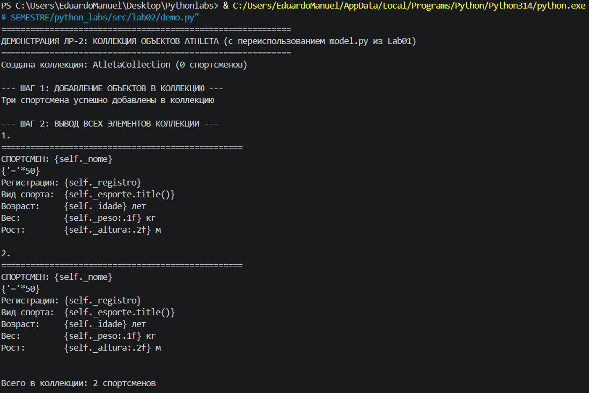
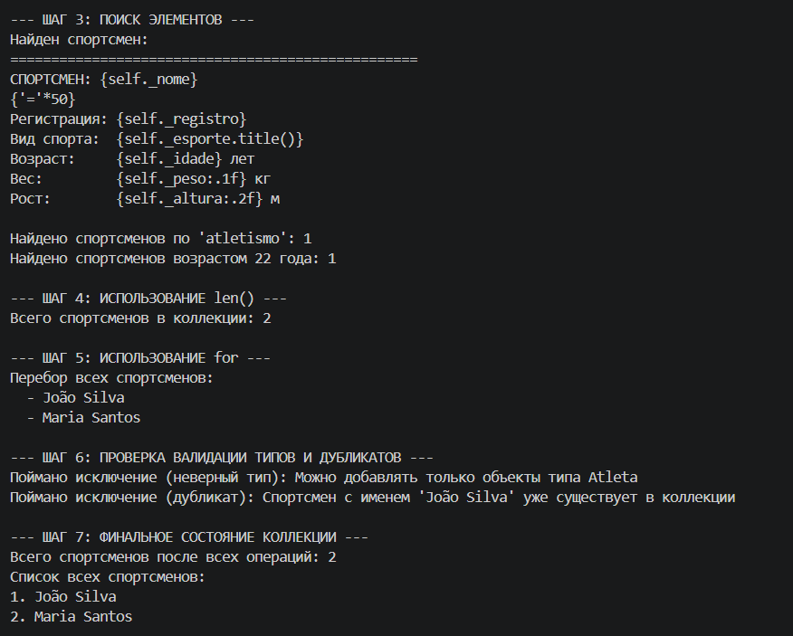
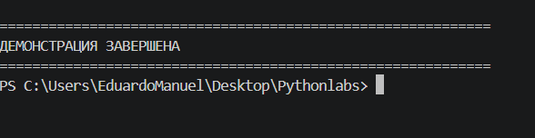

# ЛР-2 — Коллекция объектов

# Цель работы
* Научиться работать с коллекциями объектов.
* Понять разницу между моделью сущности и контейнером объектов.
* Реализовать собственный контейнерный класс.
* Освоить итерацию по объектам.
* Реализовать базовые операции управления коллекцией.

# О проекте

# Описание класса контейнера AthleteCollection

Класс AthleteCollection — это контейнер для хранения и управления объектами класса Athlete (созданного в первой лабораторной работе).

Он обеспечивает безопасное управление коллекциями спортсменов: добавление, удаление, поиск по имени, сортировка и фильтрация объектов с учётом специфики спортивной предметной области.

# Основные характеристики:

* Управление — добавление спортсменов, удаление (по объекту и по индексу), доступ к элементам по индексу.
* Поиск — по имени спортсмена, а также универсальный поиск по различным атрибутам (вес, рекорд, рейтинг и т. д.).
* Сортировка — по рейтингу, весу, рекорду или любому другому атрибуту на выбор пользователя.
* Фильтрация — получение подколлекций: спортсмены с весом выше заданного порога, с рекордом не ниже указанного уровня, с рейтингом выше определённого значения и т. п.
* Хранение — список объектов Athlete.
* Итерация — поддержка циклов for для последовательного обхода всех спортсменов в коллекции.
* Безопасность — проверка типов добавляемых объектов (только Athlete), предотвращение дубликатов (например, по имени спортсмена).

## Методы коллекции

# Основные управленческие операции:

add(item) — добавить спортсмена в коллекцию.

get_all() — получить список всех спортсменов.

# Магические методы:

* __len__ — получение количества спортсменов в коллекции (через len(collection)).
* __iter__ — обеспечение возможности итерации (например, в цикле for item in collection).
* __getitem__ — доступ к спортсмену по индексу (например, collection[0]).
* __str__ — удобное текстовое представление информации о коллекции, понятное пользователю.

# Методы удаления и поиска:

* remove(item) — удалить спортсмена по объекту.
* remove_at(index) — удалить спортсмена по индексу.
* find_by_name(name) — поиск спортсмена по имени.
* find_by(**criteria) — универсальный поиск и фильтрация по заданным критериям (имя, вес, рекорд, рейтинг и др.).

# Методы сортировки и фильтры:

* sort_by_rating(reverse=True) — сортировка спортсменов по рейтингу (по умолчанию — в порядке убывания).
* sort_by(attribute, reverse=False) — универсальная сортировка по указанному атрибуту (рейтинг, вес, рекорд и т. д.).
* get_heavyweight_athletes(min_weight) — возвращает новую коллекцию спортсменов с весом не менее указанного.
* get_high_record_athletes(min_record) — возвращает новую коллекцию спортсменов, чей рекорд не ниже заданного значения.
* get_high_rating_athletes(min_rating) — возвращает новую коллекцию спортсменов с рейтингом не ниже указанного.

# Демонстрация проекта

 