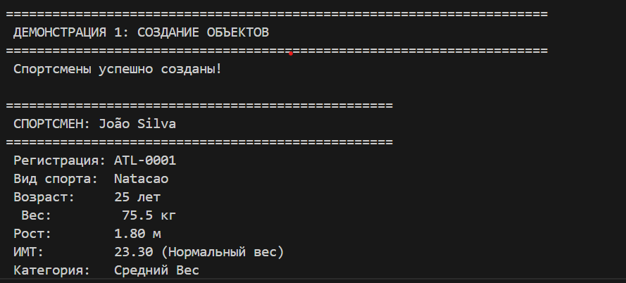
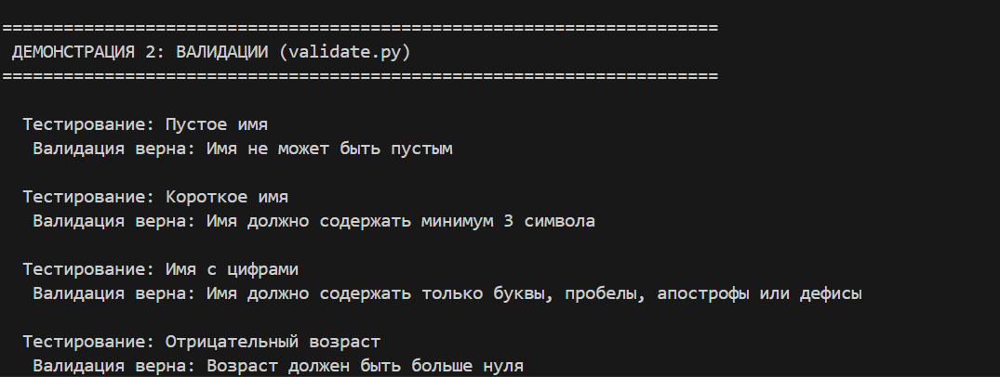
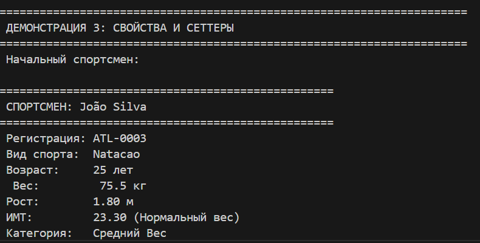
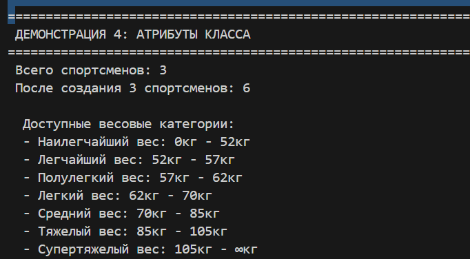
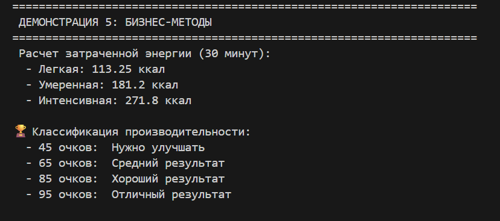
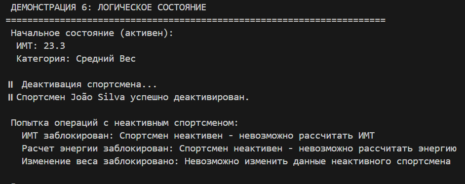
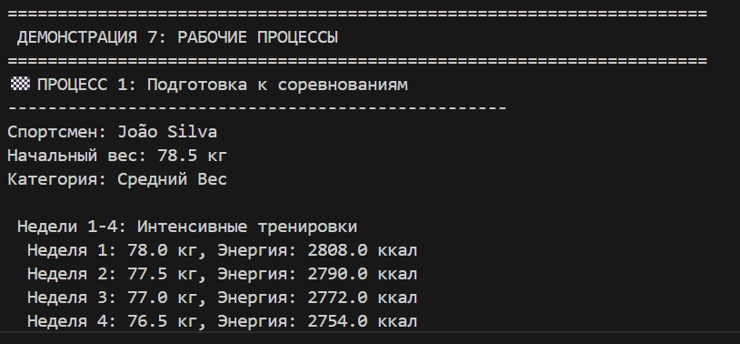

# ЛР-1 — Класс и инкапсуляция (Python 3.x)
## Цель работы
* Освоить объявление пользовательских классов.
* Разобраться с инкапсуляцией (атрибуты экземпляра, закрытые поля).
* Реализовать свойства (@property).
* Переопределить магические методы (__str__, __repr__, __eq__).
* Осознать разницу между атрибутами класса и экземпляра.

# О проекте

## Класс Спортсмен:
Класс, представляющий спортсмена, отвечающего всем лабораторным требованиям:
- Частные атрибуты
- Недвижимость (@property)
- Проверка данных (через модуль validate.py)
- Магические методы
- Бизнес-методы
- Атрибуты класса
- Логическое состояние

# Атрибут класса:
* categoria_pesos: Categorias de peso
* всего_спортсменов: para contador de instâncias
* коэффициенты_интенсивности: Fatores de intensidade para cálculo de energia

# Атрибуты экземпляра (частные поля):
* _nome: Nome do atleta 
* _idade: idade do atleta
* _peso: Peso do atleta
* _altura: altura do atleta
* _esporte: Tipo de esporte do atleta
* _ativo: permite controlar logicamente se o atleta está ativo no sistema 
* _registro: Cada atleta recebe um número de registro único, que não é repetido.
* _nivel: classe para acompanhar e classificar o nível de condicionamento físico de um atleta. 

# Недвижимость (@property):
* Leitura: registro — número de registro único do atleta (formato ATL-XXXX)  
* Leitura: imc — índice de massa corporal (calculado como peso / altura²)  
* Leitura: categoria_peso — categoria de peso do atleta de acordo com as faixas definidas  
* Leitura: imc_classificacao — classificação do IMC segundo os padrões da OMS  
* Leitura: ativo — estado lógico do atleta (ativo/inativo)  
* Leitura e Escrita: nome — nome do atleta (com validação ao alterar)  
* Leitura e Escrita: idade — idade do atleta em anos (com validação ao alterar)  
* Leitura e Escrita: peso — peso do atleta em quilogramas (com validação ao alterar)  
* Leitura e Escrita: altura — altura do atleta em metros (com validação ao alterar)  
* Leitura e Escrita: esporte — modalidade esportiva do atleta (com validação ao alterar)  
* Leitura e Escrita: nivel — nível de desempenho do atleta ("Iniciante", "Nível Médio", "Avançado", "Elite")
        
# Магические методы:
* __str__ — Apresentação amigável e formatada das informações do atleta, legível para o utilizador (mostra nome, registro, idade, peso, altura, IMC, categoria de peso, nível, estado de atividade etc.)  
* __repr__ — Representação técnica do objeto atleta, destinada a desenvolvedores (exibe os valores dos principais atributos internos: nome, idade, peso, altura, esporte, estado de atividade)  
* __eq__ — Comparação de igualdade entre dois atletas com base no número de registro (_registro); retorna `True` se os registros forem iguais, `False` caso contrário  
* __lt__ — Comparação para ordenação de atletas com base no valor do IMC (índice de massa corporal); permite ordenar uma lista de atletas pelo IMC em ordem crescente  
* __hash__ — Gera um valor hash baseado no número de registro (_registro), permitindo o uso de objetos `Atleta` como chaves em dicionários ou elementos em conjuntos (`set`)    

# Демонстрация проекта
## ДЕМОНСТРАЦИЯ 1: СОЗДАНИЕ ОБЪЕКТОВ

## ДЕМОНСТРАЦИЯ 2: ВАЛИДАЦИИ (validate.py)

 ## ДЕМОНСТРАЦИЯ 3: СВОЙСТВА И СЕТТЕРЫ
 
  ## ДЕМОНСТРАЦИЯ 4: АТРИБУТЫ КЛАССА
  
   ## ДЕМОНСТРАЦИЯ 5: БИЗНЕС-МЕТОДЫ
   
   ## ДЕМОНСТРАЦИЯ 6: ЛОГИЧЕСКОЕ СОСТОЯНИЕ
   
   ## ДЕМОНСТРАЦИЯ 7: РАБОЧИЕ ПРОЦЕССЫ
    