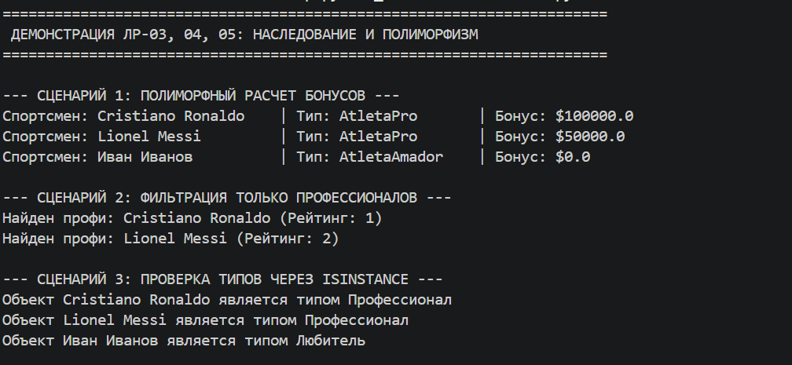
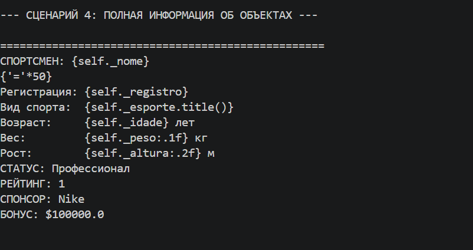
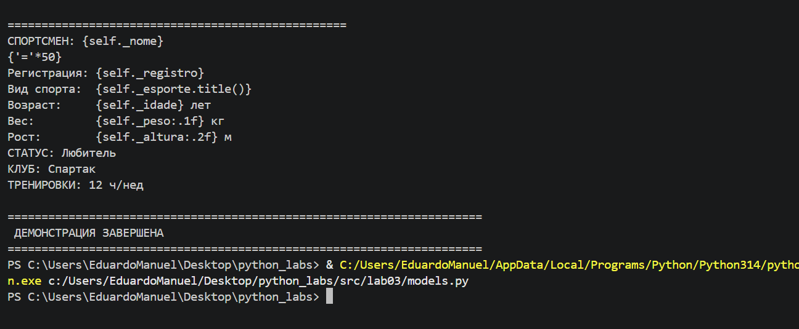

# ЛР-3 — Наследование и иерархия классов
## Цель работы
* Освоить механизм наследования классов.
* Научиться строить иерархию объектов.
* Понять разницу между:
    * базовым классом
    * производным классом
* Научиться переиспользовать код.
* Освоить переопределение методов.

# О проекте

Целью этой лабораторной работы является реализация концепций ООП на примере системы управления фитнес‑активностями. Акцент сделан на:

* Наследование: повторное использование логики базового класса Athlete для различных типов спортсменов.
* Полиморфизм: создание общего интерфейса для выполнения упражнений и участия в соревнованиях, где разные типы спортсменов и упражнений ведут себя по‑разному.
* Инкапсуляция: защита данных о весе, рекордах, рейтингах и длительности тренировок через приватные атрибуты и контролируемый доступ.

# Описание иерархии классов и методов
Структура организована для избежания дублирования кода и обеспечения возможности расширения системы.

Базовый класс (Athlete): содержит основные атрибуты:
    * имя (name);
    * вес (weight);
    * рекорд (record) — лучший результат в каком‑либо упражнении;
    * рейтинг (rating) — общий уровень подготовки.

Промежуточный интерфейс (Trainable — base.py): определяет контракт:

    * perform_exercise(exercise) — выполнение упражнения;
    * get_stats() — получение статистики спортсмена.
Дочерние классы (models.py):

1. ProfessionalAthlete: специализируется на профессиональных спортсменах.

    * __init__: использует super() для инициализации базовых данных, добавляет атрибут team (команда, за которую выступает).

    * perform_exercise(exercise) (переопределение/полиморфизм): изменяет исходное поведение — учитывает специализацию спортсмена (например, тяжелоатлет получает больший прирост рекорда в силовых упражнениях).

    * get_stats(): реализует общий интерфейс, добавляет информацию о команде и специализации.

    * __str__: настраивает отображение для пользователя, включая рейтинг и принадлежность к команде.
2. AmateurAthlete: специализируется на любителях.

    * __init__: в дополнение к базовым данным инициализирует атрибут goal (цель тренировок: похудение, набор массы и т. п.).

    * perform_exercise(exercise) (переопределение/полиморфизм): добавляет бизнес‑правило — прогресс зависит от соответствия упражнения цели. Если упражнение не соответствует цели, прогресс минимален.

    * check_progress() (специфический метод): анализирует прогресс относительно цели на основе выполненных упражнений и изменения веса.

    * get_stats(): реализует общий интерфейс, ориентированный на информацию о прогрессе к цели.

    * __str__: добавляет статус прогресса в удобочитаемом виде.
3. Exercise (базовый класс упражнений):

    * атрибуты: название (name), тип (type: силовая, кардио и т. д.), длительность (duration).

    * метод execute(athlete): базовый алгоритм выполнения упражнения спортсменом.

4. StrengthExercise (дочерний класс): специализируется на силовых упражнениях.

    * __init__: наследует базовые данные, добавляет weight_used (используемый вес).

    * execute(athlete) (переопределение): изменяет логику — прирост рекорда зависит от weight_used. Для ProfessionalAthlete прирост больше.

5. CardioExercise (дочерний класс): специализируется на кардио‑упражнениях.

    * __init__: наследует базовые данные, добавляет intensity (интенсивность).

    * execute(athlete) (переопределение): изменяет логику — снижение веса зависит от intensity и длительности. Для AmateurAthlete с целью «похудение» эффект усилен.

6. Team:

    * атрибуты: название (name), список спортсменов (members).

    * методы: add_athlete(athlete), get_team_rating() (средний рейтинг команды).

7. Competition:

    * атрибуты: название (name), тип (type), список участников (participants).

    * методы: register_athlete(athlete), start() — запускает соревнование, вызывает perform_exercise для всех участников с заданным упражнением, определяет победителя по рекордам/рейтингу.

# Демонстрация проекта
--- СЦЕНАРИЙ 1: ПОЛИМОРФНЫЙ РАСЧЕТ БОНУСОВ ---

--- СЦЕНАРИЙ 4: ПОЛНАЯ ИНФОРМАЦИЯ ОБ ОБЪЕКТАХ ---

# Заключение
В ходе этой лабораторной работы стало ясно, что наследование позволяет не просто копировать код, а создавать логические категории спортсменов и упражнений. Полиморфизм оказался мощным инструментом для поддержания чистоты кода: каталог спортсменов и упражнений может расти за счёт новых типов (например, YogaAthlete, EnduranceExercise) без изменения основного цикла тренировок в demo.py. Инкапсуляция гарантирует целостность данных о рекордах и рейтингах. Система готова к расширению и может быть основой для полноценного фитнес‑приложения.