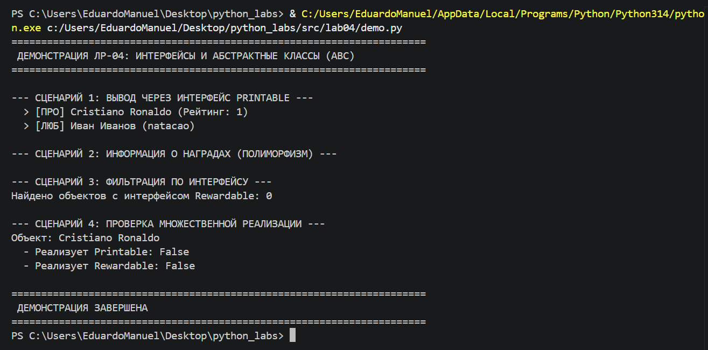

## ЛР-4 — Интерфейсы и абстрактные классы (ABC)

# Цель работы
* Познакомиться с абстрактными базовыми классами (ABC).
* Освоить понятие интерфейса (контракта поведения).
* Научиться задавать обязательные методы для классов.
* Закрепить полиморфизм через единый интерфейс.
* Научиться проектировать архитектуру, а не просто классы.

# О проекте
В этой лабораторной работе система управления фитнес‑активностями преобразована с использованием интерфейсов и абстрактных классов. Это позволяет стандартизировать поведение различных сущностей и обеспечить гибкость расширения системы.

Интерфейсы (interfaces.py):

* Trainable: требует реализации метода perform_exercise(exercise). Гарантирует, что любой объект, реализующий этот интерфейс, может выполнять упражнения.
* Trackable: требует реализации метода get_progress(). Гарантирует, что прогресс объекта (спортсмена, тренировки) можно отследить.
* Competitive: требует реализации метода participate_in_competition(competition). Гарантирует, что объект может участвовать в соревнованиях.
* Displayable: требует реализации метода display_info(). Гарантирует, что каждый объект может предоставить удобочитаемую информацию о себе.

Абстрактный базовый класс (base.py):
* Exercise (ABC): определяет шаблон для всех упражнений. Содержит абстрактный метод execute(athlete), который должен быть реализован в каждом дочернем классе. Также может содержать общие атрибуты: name, duration.

Классы (models.py):

1. Athlete: базовый класс спортсмена, реализует интерфейсы Trainable, Trackable, Displayable.
* атрибуты: name, weight, record, rating;
* методы: perform_exercise(exercise), get_progress(), display_info().
2. ProfessionalAthlete: наследует от Athlete, дополнительно реализует интерфейс Competitive.
* атрибут: team;
* метод: participate_in_competition(competition) — логика участия в соревнованиях с учётом профессионального уровня.
3. AmateurAthlete: наследует от Athlete.
* атрибут: goal (цель тренировок);
* переопределённый метод get_progress() — прогресс рассчитывается относительно цели.
4. StrengthExercise: наследует от Exercise, реализует Displayable.
* атрибут: weight_used;
* метод execute(athlete) — реализация выполнения силового упражнения (прирост рекорда зависит от weight_used).
5. CardioExercise: наследует от Exercise, реализует Displayable.
* атрибут: intensity;
* метод execute(athlete) — реализация выполнения кардио‑упражнения (снижение веса зависит от intensity и длительности).
6. Workout: реализует интерфейсы Trackable, Displayable.
* атрибуты: exercises (список упражнений), duration;
* методы: add_exercise(exercise), start_workout(athlete), get_progress() (прогресс тренировки), display_info().
7. Team: реализует Competitive, Displayable.
* атрибуты: name, members (список спортсменов);
* методы: add_athlete(athlete), participate_in_competition(competition), display_info().
8. Competition: реализует Displayable.
* атрибуты: name, type, participants;
* методы: register_participant(participant), start(), display_info().

# Демонстрация проекта 
ИНТЕРФЕЙСЫ И АБСТРАКТНЫЕ КЛАССЫ (ABC)

