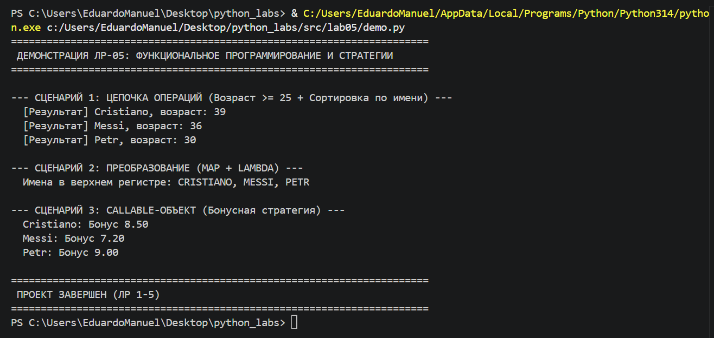

# ЛР-5 — Функции как аргументы. Стратегии и делегаты.
# Цель работы
* Освоить передачу функций как аргументов в другие функции и методы.
* Научиться применять встроенные функции высшего порядка: map, filter, sorted.
* Понять концепцию паттерна «Стратегия» и реализовать его на Python.
* Освоить lambda-выражения и их практическое применение.
* Интегрировать функциональный стиль с объектно-ориентированным кодом из предыдущих ЛР.

# О проекте
Система управления фитнес‑активностями дополнена функциональными возможностями для гибкого расчёта показателей и применения разных стратегий тренировок.

Классы и интерфейсы (models.py):

1. Athlete (базовый класс):
* атрибуты: name, weight, record, rating;
* метод: calculate_progress(strategy) — принимает функцию‑стратегию для расчёта прогресса.
2. Exercise (базовый класс):
* атрибуты: name, duration;
* метод: execute(athlete, modifier) — выполняет упражнение с модификатором (функция).
3. Workout (класс тренировки):
* атрибут: exercises (список упражнений);
* методы:
    * apply_strategy(strategy_func) — применяет стратегию ко всем упражнениям;
    * get_total_duration() — возвращает суммарную длительность.
4. Паттерн «Стратегия»:
* strength_strategy — стратегия для силовых тренировок (увеличивает рекорд);
* cardio_strategy — стратегия для кардио (снижает вес);
* balance_strategy — сбалансированная стратегия (работает с весом и рекордом).

# Демонстрация проекта (demo.py)
ФУНКЦИОНАЛЬНОЕ ПРОГРАММИРОВАНИЕ И СТРАТЕГИИ
