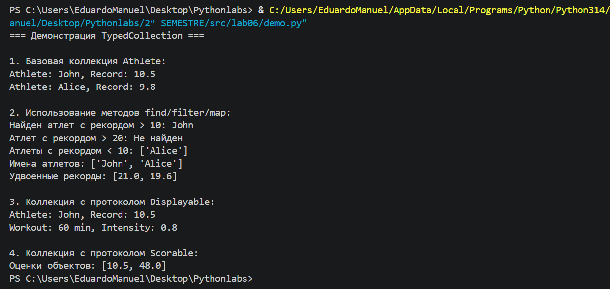

# Лабораторная работа №6 — Generics и typing
## Цель работы
Освоить систему аннотаций типов в Python (typing), научиться создавать обобщённые (generic) классы с помощью `TypeVar` и `Generic`, понять концепцию структурной типизации через `typing.Protocol`.

## Описание реализованных типов и контейнеров

### Реализованные Generic‑классы
- `TypedCollection[T]` — обобщённая коллекция, хранящая элементы одного типа.
### Использованные TypeVar
- `T` — универсальный тип для элементов коллекции.
- `R` — тип результата для метода `map()` (может отличаться от `T`).
- `D` (с ограничением `bound=Displayable`) — тип для объектов с методом `display()`.
- `S` (с ограничением `bound=Scorable`) — тип для объектов с методом `score()`.
### Протоколы
- `Displayable` — требует метод `display() -> str`.
- `Scorable` — требует метод `score() -> float`.

Классы `Athlete` и `Workout` соответствуют этим протоколам без явного наследования.

## Демонстрация работы

### Сценарии из demo.py
1. **Базовая коллекция `Athlete`** — создание коллекции, добавление элементов, вывод через `display()`.
2. **Методы `find/filter/map`** — поиск, фильтрация и преобразование данных с изменением типа результата.
3. **Коллекция с протоколом `Displayable`** — добавление разнотипных объектов с методом `display()`, безопасный вызов метода.
4. **Коллекция с протоколом `Scorable`** — работа с объектами, имеющими метод `score()`, преобразование в список оценок.

