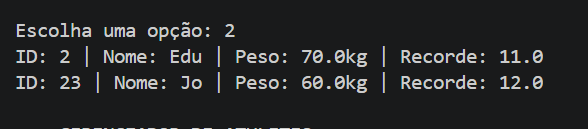
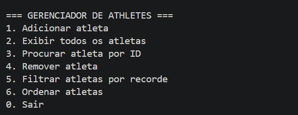
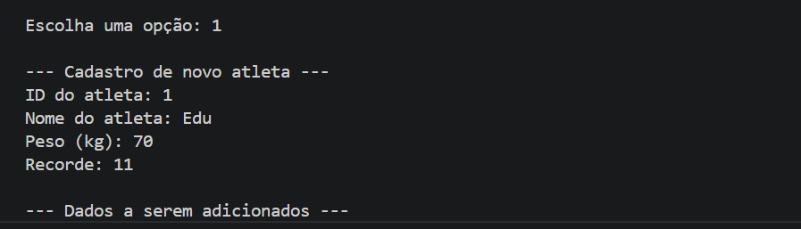
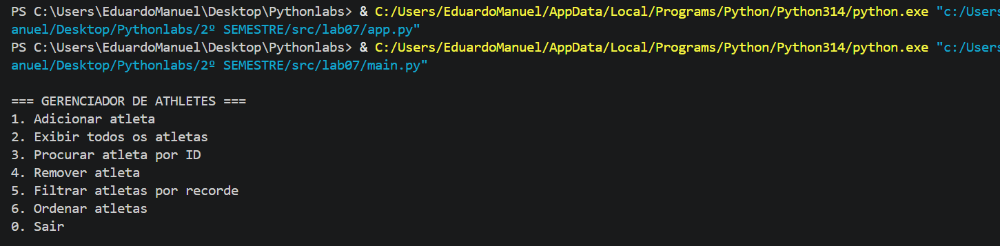
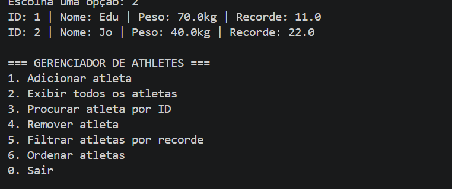

## ЛР-7 — Консольное приложение
# Цель работы
Объединить все знания, полученные в ЛР1–ЛР6, в единое работающее приложение.
Реализовать интерактивный CLI-интерфейс с меню и вводом пользователя.

