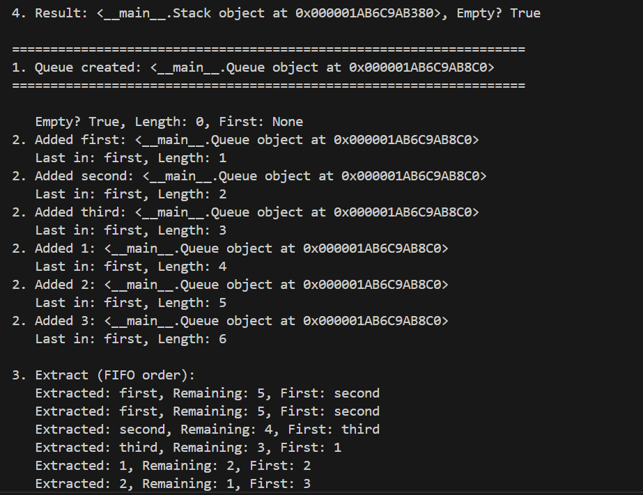

```python 
from typing import Any, Optional, Iterator


class Node:
    """Singly linked list node."""

    def __init__(self, value: Any, next: Optional["Node"] = None):
        self.value = value 
        self.next = next

    def __repr__(self) -> str:
        """A string representation of the node as [value]."""
        return f"[{self.value}]"


class SinglyLinkedList:
    """Singly linked list."""

    def __init__(self):
        self.head: Optional[Node] = None
        self.tail: Optional[Node] = None  # to speed up append
        self._size: int = 0

    def append(self, value: Any) -> None:
        """Add an element to the end of a list in O(1) time using tail."""
        new_node = Node(value)

        if self.head is None:
            self.head = new_node
            self.tail = new_node
        else:
            assert (
                self.tail is not None
            )  # Type checker: tail is not None when head is not None
            self.tail.next = new_node
            self.tail = new_node

        self._size += 1

    def prepend(self, value: Any) -> None:
        """Add an element to the beginning of a list in O(1)."""
        new_node = Node(value, next=self.head)
        self.head = new_node

        # If the list was empty, update tail
        if self.tail is None:
            self.tail = new_node

        self._size += 1

    def insert(self, idx: int, value: Any) -> None:
        """Insert an element at index idx."""
        # Checking the index correctness
        if idx < 0 or idx > self._size:
            raise IndexError(f"Index {idx} out of range [0, {self._size}]")

        # Insert at the beginning
        if idx == 0:
            self.prepend(value)
            return

        # Вставка в конец
        if idx == self._size:
            self.append(value)
            return

        # Middle insert
        assert (
            self.head is not None
        )  # Type checker: head is not None when inserting in middle
        current = self.head
        for _ in range(idx - 1):
            assert (
                current.next is not None
            )  # Type checker: current.next is not None during traversal
            current = current.next

        new_node = Node(value, next=current.next)
        current.next = new_node
        self._size += 1

    def remove(self, value: Any) -> bool:
        """Removes the first occurrence of value. Returns True if the element was removed."""
        if self.head is None:
            return False

        # Delete from the beginning
        if self.head.value == value:
            self.head = self.head.next
            # If the list becomes empty, update tail
            if self.head is None:
                self.tail = None
            self._size -= 1
            return True

        # Finding an element to delete
        current = self.head
        while current.next is not None:
            if current.next.value == value:
                # Delete the element
                current.next = current.next.next
                # If the last element was deleted, update tail
                if current.next is None:
                    self.tail = current
                self._size -= 1
                return True
            current = current.next

        return False

    def remove_at(self, idx: int) -> Any:
        """Removes the element at index idx and return its value."""
        if idx < 0 or idx >= self._size:
            raise IndexError(f"Index {idx} out of range [0, {self._size - 1}]")

        assert self._size > 0  # Type checker: size > 0 means head is not None
        assert self.head is not None  # Type checker: head is not None when size > 0

        # Deletation from the beginning
        if idx == 0:
            value = self.head.value
            self.head = self.head.next
            # If the list becomes empty, update tail
            if self.head is None:
                self.tail = None
            self._size -= 1
            return value

        # Removal from the middle or end
        current = self.head
        for _ in range(idx - 1):
            assert (
                current.next is not None
            )  # Type checker: current.next is not None during traversal
            current = current.next

        assert (
            current.next is not None
        )  # Type checker: current.next is not None for removal
        value = current.next.value
        current.next = current.next.next

        # If the last element was deleted, update tail
        if current.next is None:
            self.tail = current

        self._size -= 1
        return value

    def __iter__(self) -> Iterator[Any]:
        """An iterator over the values ​​in a list (from head to tail)."""
        current = self.head
        while current is not None:
            yield current.value
            current = current.next

    def __len__(self) -> int:
        """The number of elements in the list."""
        return self._size

    def __repr__(self) -> str:
        """String representation of the list in constructor format."""
        values = list(self)
        return f"SinglyLinkedList({values})"

    def visualize(self) -> str:
        """A nice visual representation of the list: [A] -> [B] -> [C] -> None"""
        if self.head is None:
            return "None"

        result_parts = []
        current = self.head

        while current is not None:
            result_parts.append(f"{current}")  # используем __repr__ Node
            current = current.next

        result_parts.append("None")
        return " -> ".join(result_parts)

    def __str__(self) -> str:
        """String representation with nice visualization of relationships."""
        return self.visualize()


if __name__ == "__main__":
    lst = SinglyLinkedList()

    lst.append(1)
    lst.append(2)
    lst.append(3)
    print(f"\nAfter append: {lst}")
    print(f"Nice output: {str(lst)}")

    lst.prepend(0)
    print(f"\nAfter prepend: {lst}")
    print(f"Nice output: {str(lst)}")

    lst.insert(2, 1.5)
    print(f"\nAfter insert(2, 1.5): {lst}")
    print(f"Nice output: {str(lst)}")

    lst.remove(1.5)
    print(f"\nAfter remove(1.5): {lst}")
    print(f"Nice output: {str(lst)}")

    removed = lst.remove_at(1)
    print(f"\nУдалён элемент: {removed}")
    print(f"После remove_at(1): {lst}")
    print(f"Красивый вывод: {str(lst)}")

    letters = SinglyLinkedList()
    letters.append("A")
    letters.append("B")
    letters.append("C")
    print(f"\nСписок букв: {str(letters)}")  # List of letters
```
## A. Реализовать и StackQueue (src/lab10/structures.py)
.png)



## B. Реализовать SinglyLinkedList (src/lab10/linked_list.py)
```python 
from collections import deque
from typing import Any


class Stack:
    """A stack (LIFO) data structure based on list."""  # «стек»

    def __init__(self):
        self._data: list[Any] = []

    def push(self, item: Any) -> None:
        """Add an element to the top of the stack."""
        self._data.append(item)

    def pop(self) -> Any:
        """Removes the top element of the stack and returns it."""
        if self.is_empty():
            raise IndexError("pop from empty stack")
        return self._data.pop()

    def peek(self) -> Any | None:
        """Returns the top element without removing it. Returns None if the stack is empty."""
        if self.is_empty():
            return None
        return self._data[-1]

    def is_empty(self) -> bool:
        """Returns True if the stack is empty, otherwise False."""
        return len(self._data) == 0

    def __len__(self) -> int:
        """The number of elements in the stack."""
        return len(self._data)


class Queue:
    """A FIFO data structure based on collections.deque."""  # «очередь»

    def __init__(self):
        self._data: deque[Any] = deque()

    def enqueue(self, item: Any) -> None:
        """Add an item to the end of the queue."""
        self._data.append(item)

    def dequeue(self) -> Any:
        """
        Removes the left element from the front of the queue and returns it.
        \nIf the queue is empty, returns IndexError exception.
        """
        if self.is_empty():
            raise IndexError("dequeue from empty queue")
        return self._data.popleft()

    def peek(self) -> Any | None:
        """Returns the first element without removing it. Returns None if the queue is empty."""
        if self.is_empty():
            return None
        return self._data[0]

    def is_empty(self) -> bool:
        """Returns True if the queue is empty."""
        return len(self._data) == 0

    def __len__(self) -> int:
        """Number of elements in the queue."""
        return len(self._data)


# --------------------------------------------------------------#
# ---------------------------TESTING----------------------------#
# --------------------------------------------------------------#


if __name__ == "__main__":
    # ----------------------LIFO---------------------------------#
    stack = Stack()
    print("\n===================================================================")
    print(f"1. Stack created: {stack}")
    print("===================================================================")

    print(f"   Empty? {stack.is_empty()}, Length: {len(stack)}, Top: {stack.peek()}")

    elements = [15, 30, 5, "Author", ["David", "Laurindo"]]
    for elem in elements:
        # Executing LIFO
        stack.push(elem)  # Adding new elements to the top of the list
        print(f"2. Added {elem}: {stack}")  # Showing added element
        print(f"   Upper: {stack.peek()}, Length: {len(stack)}")  # Element on the Top

    print(f"\n   Empty? {stack.is_empty()}, Length: {len(stack)}, Top: {stack.peek()}")

    print("\n3. Extract (LIFO order):")
    while not stack.is_empty():  # Extrating elements from the top of the list
        item = stack.pop()  # Extration
        print(f"   Extracted: {item}, Remaining: {len(stack)}, Top: {stack.peek()}")

    print(f"\n4. Result: {stack}, Empty? {stack.is_empty()}")

    # ----------------------FIFO---------------------------------#
    q = Queue()

    # FIFO Initialization
    print("\n===================================================================")
    print(f"1. Queue created: {q}")
    print("===================================================================")
    print(f"\n   Empty? {q.is_empty()}, Length: {len(q)}, First: {q.peek()}")

    # Adding elements
    elements = ["first", "second", "third", 1, 2, 3]
    for element in elements:
        q.enqueue(element)
        print(f"2. Added {element}: {q}")
        print(f"   Last in: {q.peek()}, Length: {len(q)}")

    # Extracting elements
    print("\n3. Extract (FIFO order):")
    while not q.is_empty():
        item = q.dequeue()
        print(f"   Extracted: {item}, Remaining: {len(q)}, First: {q.peek()}")

    # Result
    print(f"\n4. Result: {q}, Empty? {q.is_empty()}")
```
## B. Реализовать SinglyLinkedList (src/lab10/linked_list.py)


## теоретическая часть

## ЛР10 — Структуры данных: Stack, Queue, Linked List и бенчмарки
Цель: реализовать базовые структуры данных (стек, очередь, связный список), сравнить их производительность и научиться думать в терминах асимптотики (O(1), O(n)).

Результат ЛР
После выполнения ЛР10 в репозитории должны появиться:

src/lab10/structures.py
Реализация:

class Stack — стек на базе :list
class Queue — очередь на базе :collections.deque
src/lab10/linked_list.py
Реализация:

class Node — узел односвязного списка
class SinglyLinkedList — односвязный список.
lab10/README.md
Отчёт по ЛР10 должен содержать:

краткую теорию:
что такое стек / очередь / связный список
типичные операции и их сложность
описание реализованных классов с примерами использования
выводы по бенчмаркам:
какая структура медленнее/быстрее и почему
images/lab10/
Скриншоты:

примеры использования структур в интерпретаторе через python -m
Рекомендуемая структура репозитория
python_labs/
├─ README.md
├─ src/
│   ├─ lab08/
│   ├─ lab09/
│   └─ lab10/
│       ├─ structures.py      # Stack и Queue
│       └─ linked_list.py     # SinglyLinkedList 
├─ data
└─ images/
    └─ lab10/